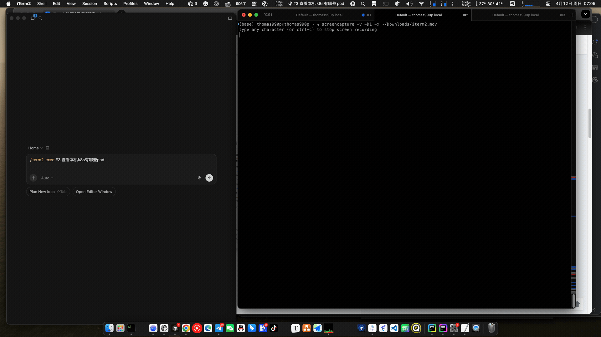

# cursor-skills

个人 [Cursor Agent Skills](https://cursor.com/docs/skills) 合集——用于扩展 Cursor Agent 在本机的自动化能力。

每个 Skill 是一个独立目录，包含一份 `SKILL.md`（Agent 行为指引）和可选的辅助脚本。Agent 会根据上下文自动判断是否触发对应 Skill。

## 安装与使用

Cursor、Codex、Claude Code 均支持相同的 SKILL.md 格式，使用步骤完全一致，**仅安装目录不同**：

| 工具 | Skills 目录 |
|------|------------|
| [Cursor](https://cursor.com) | `~/.cursor/skills/` |
| [Codex CLI](https://github.com/openai/codex) | `~/.codex/skills/` |
| [Claude Code](https://docs.anthropic.com/claude/docs/claude-code) | `~/.claude/skills/` |

**Skills 目录通常已有其他内容，请勿直接 `git clone` 到该目录（会报错或覆盖）。** 推荐按下方任一方式安装：

### 方式一：只复制 Skill 子目录（最安全，推荐）

```bash
# 以 Cursor 为例，其他工具替换目录即可
SKILLS_DIR=~/.cursor/skills   # Codex: ~/.codex/skills  Claude: ~/.claude/skills

git clone https://github.com/yangyongyongyong/skills /tmp/cursor-skills-repo
cp -r /tmp/cursor-skills-repo/iterm2-exec "$SKILLS_DIR/"
rm -rf /tmp/cursor-skills-repo
```

### 方式二：克隆到独立目录，再软链接各 Skill

```bash
git clone https://github.com/yangyongyongyong/skills ~/projects/cursor-skills

# 按需链接到各工具的 Skills 目录
ln -s ~/projects/cursor-skills/iterm2-exec ~/.cursor/skills/iterm2-exec
# ln -s ~/projects/cursor-skills/iterm2-exec ~/.codex/skills/iterm2-exec
```

方式二的好处：后续 `git pull` 一次即可更新所有工具的 Skill。

### 方式三：目录为空时直接克隆

仅在目录**不存在或为空**时适用：

```bash
git clone https://github.com/yangyongyongyong/skills ~/.cursor/skills
```

---

## Skills 一览

### `iterm2-exec` — 通过 iTerm2 在本机/远端会话执行命令

让 Cursor Agent 直接向 iTerm2 中已有的标签页（包括 SSH、docker exec 等远端会话）发送命令并取回输出，无需额外建立连接。



#### 技术架构

```
┌─────────────────────────────────────────────────────────────────┐
│  Cursor Agent                                                   │
│    iterm2_exec.py run --tab-num 2 --command "ls -la"            │
└──────────────────────────┬──────────────────────────────────────┘
                           │ iTerm2 Python API（Unix socket）
                           ▼
┌─────────────────────────────────────────────────────────────────┐
│  iTerm2                                                         │
│                                                                 │
│  Tab 1: 本地 shell          Tab 2: SSH / docker exec           │
│  ┌─────────────────┐        ┌───────────────────────────┐      │
│  │ Shell Integration│       │  远端 shell（无需装 SI）   │      │
│  │ 已安装           │       │                           │      │
│  │                 │       │                           │      │
│  │  SI 模式         │       │  哨兵模式                  │      │
│  │  直发裸命令       │       │  printf 不可见 Escape      │      │
│  │  output_range   │       │  Sequence 检测完成          │      │
│  │  精确截取输出     │       │  捕获输出返回 Agent         │      │
│  └─────────────────┘        └───────────────────────────┘      │
└─────────────────────────────────────────────────────────────────┘
```

两种执行模式自动选择：
- **SI 模式**（本地 shell 已装 Shell Integration）：直发命令，`output_range` 精确定位输出范围，完全免疫终端 resize 干扰
- **哨兵模式**（SSH / Docker / 未装 SI）：在命令前后插入不可见的 Custom Escape Sequence 作为边界，远端只需有 `printf`，无需安装任何额外工具

**前置要求**：macOS，iTerm2 已运行并开启 Python API（Preferences → General → Magic）。

**快速开始**：

```bash
# 安装依赖（仅首次）
python3 -m venv ~/.cursor/skills/iterm2-exec/.venv
~/.cursor/skills/iterm2-exec/.venv/bin/pip install iterm2

# 向默认标签（⌘1）发命令
~/.cursor/skills/iterm2-exec/.venv/bin/python \
  ~/.cursor/skills/iterm2-exec/scripts/iterm2_exec.py run \
  --command 'echo OK'
```

完整参数说明、执行模式细节、故障排查见 [`iterm2-exec/SKILL.md`](iterm2-exec/SKILL.md)。

### `jupyterlab-terminal` — 通过 WebSocket 操作 JupyterLab Terminal

让 Cursor Agent 直接向任意 JupyterLab Terminal 发送命令并实时取回输出，兼容本地、远程域名等各种部署方式，速度比浏览器截图方式快 10 倍以上。


#### 技术架构

```
┌─────────────────────────────────────────────────────────────────┐
│  setup 阶段（一次性）                                            │
│                                                                 │
│  jupyterm setup（无参数）                                        │
│    ↓                                                            │
│  扫描本机 CDP 端口 9222-9230                                     │
│    GET http://127.0.0.1:{port}/json → 获取所有 page targets      │
│    对每个 page CDP WS 执行 document.visibilityState             │
│      selected（visible）页 → 检查 URL 是否含 jupyter            │
│        含 jupyter → 读 jupyter-config-data token               │
│        不含 jupyter → 停止，提示用户切换标签                     │
│    ↓                                                            │
│  ~/.jupyterm.json  { base_url, ws_base, token }                 │
└──────────────────────────┬──────────────────────────────────────┘
                           │
┌──────────────────────────▼──────────────────────────────────────┐
│  执行阶段（每次命令）                                             │
│                                                                 │
│  jupyterm exec -t <id> "command"                                │
│    ↓                                                            │
│  JupyterLab REST API  GET /api/terminals  → terminal 列表        │
│    ↓                                                            │
│  WebSocket  ws(s)://<host>/terminals/websocket/<id>             │
│    ↓             ↑                                              │
│  发送命令      实时接收输出（用户在浏览器 Terminal 里同步可见）    │
└─────────────────────────────────────────────────────────────────┘
```

命令通过 WebSocket 直达 JupyterLab 服务端的 shell 进程，浏览器里打开的 Terminal 与 CLI 共享同一个 shell，用户能实时看到 Agent 的每一行输入和输出。

#### 前置条件

**1. 开启 Chrome 远程调试（CDP）**

`jupyterm setup` 通过 HTTP 直接访问 Chrome CDP 端口（`http://127.0.0.1:9222/json`）读取标签页信息，不借助任何 MCP，不会启动新浏览器实例。

**浏览器与远程调试说明**（以官方为准：[Chrome DevTools MCP：调试浏览器会话](https://developer.chrome.com/blog/chrome-devtools-mcp-debug-your-browser-session?hl=zh-cn)）：

- **Chrome 144（M144）及以上**：在地址栏打开 **`chrome://inspect/#remote-debugging`**，按页面提示**显式允许**远程调试连接。自 M144 起，Chrome 默认**关闭**远程调试，需在该页打开后才能被外部客户端（含本 Skill 使用的 CDP HTTP）连接。
- **任意版本（通用做法）**：用命令行带 **`--remote-debugging-port=9222`** 启动 Chrome（见下）。只要本机 `9222` 处于 LISTEN（见下文 `lsof`），`jupyterm setup` 即可通过 `http://127.0.0.1:9222/json` 读取标签页。

请使用**当前受支持**的 Chrome 稳定版；过旧版本可能缺少 M144 的 `#remote-debugging` 页面或与 CDP 行为不一致。

```bash
# macOS
/Applications/Google\ Chrome.app/Contents/MacOS/Google\ Chrome \
  --remote-debugging-port=9222

# Windows
chrome.exe --remote-debugging-port=9222
```

**验证 CDP 是否已监听**（本机有进程在 `9222` 端口 LISTEN 即表示 CDP 已开启）：

```bash
lsof -nP -iTCP:9222 -sTCP:LISTEN
```

示例返回（有输出即正常；无输出表示尚未监听，需先按上文启动带调试端口的 Chrome）：

```
COMMAND     PID   USER   FD   TYPE             DEVICE SIZE/OFF NODE NAME
Google    45231  alice  45u  IPv4 0x1234567890abcdef      0t0  TCP 127.0.0.1:9222 (LISTEN)
```

> **常见陷阱：`user-chrome-devtools` MCP 的多实例问题**
>
> `user-chrome-devtools` MCP 在 `mcp.json` 中未配置 `--browser-url=http://127.0.0.1:9222` 时，
> 会**自动启动一个新的受控 Chrome 实例**（显示"Chrome 正受到自动测试软件的控制"），
> 与用户正在使用的浏览器完全无关，导致 `list_pages` 只返回空页面。
>
> `jupyterm setup` 绕开了此问题：直接用 Python `urllib` 请求已有 Chrome 的 CDP HTTP 端口，
> 不依赖任何 MCP，多个 Chrome 实例也能正确扫描并找到 selected 标签。

**2. 浏览器中打开 JupyterLab 页面并切换到该标签**

确保 Chrome 当前激活（selected）的标签页已加载 JupyterLab（URL 含 `/lab`、`/tree` 或 `/user/`）。`jupyterm setup` 通过 `document.visibilityState` 识别 selected 标签，若当前 selected 不是 Jupyter 页会直接提示切换。

**3. JupyterLab 内至少开着一个 Terminal**

在 JupyterLab 菜单 File → New → Terminal 打开，或用 `jupyterm create` 由 Agent 创建。

> **注意**：若在容器内刚安装了新工具（如 `ping`、`curl`），旧 terminal 会话不会自动感知，新开一个 Terminal tab 即可，无需重启容器。

#### 快速开始

```bash
JUPYTERM=~/.cursor/skills/jupyterlab-terminal/jupyterm

# 首次 / Jupyter 地址变更后：自动从浏览器 selected 标签探测
$JUPYTERM setup

# 若浏览器当前标签不是 Jupyter，会提示"请切换标签后重试"

# 远程或域名部署时手动指定
$JUPYTERM setup --url http://jupyter.example.com/user/admin/lab --token <token>

# 自定义 CDP 端口（多实例场景）
$JUPYTERM setup --cdp-ports 9222,9223

# 查看当前打开的 Terminal
$JUPYTERM list

# 在用户可见的 Terminal 执行命令（-t 指定编号，用户浏览器里实时可见）
$JUPYTERM exec -t 3 "pwd"
$JUPYTERM exec -t 3 --timeout 60 "python3 ~/demos/01_kafka_demo.py"

# 创建新 Terminal
$JUPYTERM create
```

完整参数说明、Agent 使用规范与注意事项见 [`jupyterlab-terminal/SKILL.md`](jupyterlab-terminal/SKILL.md)。

---

## 目录结构

```
~/.cursor/skills/
├── README.md
├── iterm2-exec/
│   ├── SKILL.md              # Agent 触发规则、调用示例、安全约束
│   └── scripts/
│       └── iterm2_exec.py    # CLI 实现（单文件，基于 iTerm2 Python API）
└── jupyterlab-terminal/
    ├── SKILL.md              # Agent 触发规则、调用示例、注意事项
    ├── jupyterm              # bash wrapper（直接执行）
    └── jupyterm.py           # Python 实现（WebSocket + JupyterLab API）
```

---

## 添加新 Skill

1. 新建 `kebab-case` 命名的子目录。
2. 创建 `SKILL.md`，frontmatter 包含 `name` 与 `description`。
3. 辅助脚本放在 `scripts/` 子目录。
4. 更新本 README 的「Skills 一览」。

格式参考：[Cursor Agent Skills 文档](https://cursor.com/docs/skills)。

---

## License

MIT
